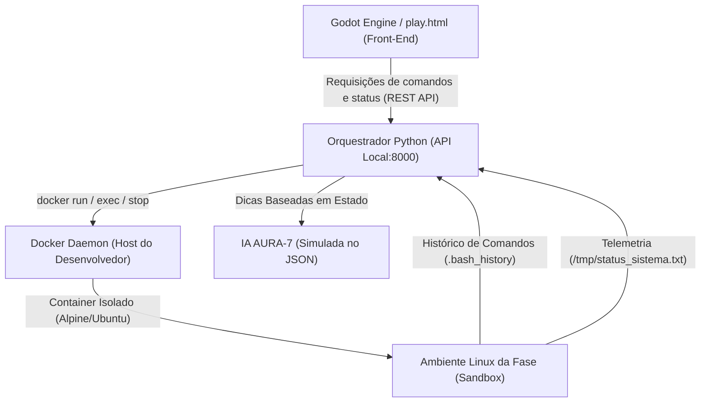

# 🧠 Mapa Mental: ROOT ACCESS - DevOps Chronicles

Este documento descreve detalhadamente o ecossistema do jogo, mapeando suas frentes tecnológicas, o fluxo de jogabilidade, o isolamento de infraestrutura e a integração entre as ferramentas.

---

## 1. Visão Geral do Ecossistema

O jogo opera sob um modelo híbrido onde a interface visual consome uma API local para interagir com sandboxes Docker reais.

---

## 2. Pilares do Jogo

| Pilar | Descrição | Componentes |
| :--- | :--- | :--- |
| **Narrativa (A Alma)** | A história de um SysAdmin contratado por corporações e bunkers no submundo DevOps. | Quadrinhos de Introdução/Vitória, E-mails de Feedback e Carteira Virtual de Recompensas. |
| **Infraestrutura (O Corpo)** | Containers Docker leves e herméticos que simulam problemas reais de servidores em produção. | Dockerfiles, Mocks de Hardware/Processos e Scripts de Falha/Monitoramento. |
| **Validação (O Cérebro)** | Script inteligente em Python que intercepta e analisa o estado interno do container sem intervenção externa. | `orchestrator.py`, `.bash_history` do jogador, arquivos de telemetria local e validações de sucesso. |
| **IA AURA-7 (A Mentora)** | Um sistema de apoio baseado no progresso real do jogador, com dicas contextuais. | Árvore de diálogos em JSON, efeito typewriter no terminal e análise de histórico de comandos. |

---

## 3. Mapeamento da Campanha (Módulos 1 a 10 - 100 Níveis)

```mermaid
gantt
    title Curva de Aprendizado e Módulos do ROOT ACCESS (100 Níveis)
    dateFormat  X
    axisFormat %d
    
    section Mod 1: Shell Básico
    Primeiros Comandos e Navegação (Nív 1-10) :active, m1, 0, 10
    
    section Mod 2: Arquivos
    Manipulação e Busca (Nív 11-20) :active, m2, 10, 20
    
    section Mod 3: Segurança
    Permissões e Usuários POSIX (Nív 21-30) :active, m3, 20, 30
    
    section Mod 4: Processamento
    Redirecionamentos e Pipes (Nív 31-40) :active, m4, 30, 40
    
    section Mod 5: Monitoramento
    Gestão de Processos/Recursos (Nív 41-50) :active, m5, 40, 50

    section Mod 6: Redes
    Conectividade e SSH Remoto (Nív 51-60) :active, m6, 50, 60

    section Mod 7: Scripting
    Automação e Scripts Bash (Nív 61-70) :active, m7, 60, 70

    section Mod 8: Git & CI-CD
    Versionamento e Hooks Automáticos (Nív 71-80) :active, m8, 70, 80

    section Mod 9: Docker
    Isolamento e Compose Local (Nív 81-90) :active, m9, 80, 90

    section Mod 10: SRE & HA
    Cluster, Resiliência e Self-Healing (Nív 91-100) :active, m10, 90, 100
```

---

## 4. Segurança e Políticas SRE
Como o jogo roda no notebook pessoal do desenvolvedor, a arquitetura foi planejada sob rígidas regras de segurança:

> [!IMPORTANT]
> **Isolamento de Recursos (Cgroups)**
> Cada container de desafio é limitado a **0.5 de CPU** e **256MB de Memória RAM** para evitar travamentos acidentais do notebook em caso de *fork bombs* ou loops de scripts.

> [!TIP]
> **Sem Bind Mounts do Host**
> Os containers não montam nenhuma pasta física do seu notebook. Toda a interação e modificação de arquivos ocorrem exclusivamente em volumes efêmeros criados dentro do Docker.

> [!CAUTION]
> **Privilégios Limitados**
> O usuário padrão do container é o `operator` (não-root). O uso de comandos administrativos (como `sudo`) é exigido nos desafios para simular permissões de segurança reais de produção.
