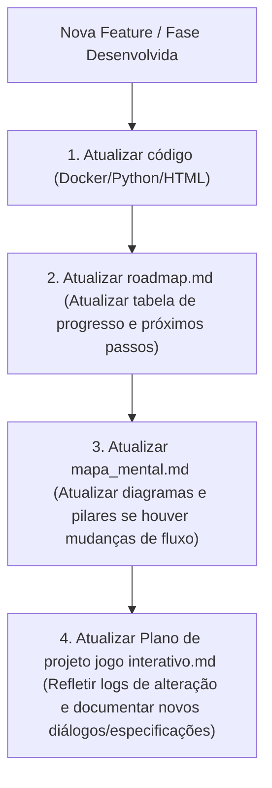

# 🗺️ Roadmap de Evolução: ROOT ACCESS - DevOps Chronicles

Este documento descreve o estado atual do desenvolvimento do jogo e define a **Regra de Sincronização** para manter toda a documentação atualizada conforme progredimos.

---

## 1. Estado Atual do Projeto

| Componente / Fase / Módulo | Status | Descrição |
| :--- | :--- | :--- |
| **Orquestrador Python (`orchestrator.py`)** | ✅ Concluído | Controle de containers Docker local, limites de CPU/Memória, validações e Servidor HTTP API integrado. |
| **Ponte Godot (`OrchestratorBridge.gd`)** | ✅ Concluído | Script GDScript pronto para conectar a Godot Engine ao Orquestrador Python. |
| **Interface Web (`index.html`)** | ⚡ Em Ajuste | Protótipo de jogo em HTML5, responsivo, atualizando a introdução para a nova narrativa e adaptando os desafios. |
| **Módulo 1: O Despertar do Shell (Níveis 1-100)** | ✅ Concluído | Curso Completo de Shell Script (10 submódulos de 10 níveis). Foco em preparar o jogador como autônomo local e para certificações (LPIC-1/LFCS). |
| **Módulo 2: Permissões, Usuários e Segurança POSIX (Níveis 101-110)** | ✅ Concluído | Gestão de privilégios, chmod octal/simbólico, chown, sudoers delegados e contas isoladas. |
| **Módulo 3: Monitoramento de Processos e Recursos (Níveis 111-120)** | ✅ Concluído | Gestão de sinais (SIGTERM/SIGKILL), htop, consumo de RAM, swap, disco e jobs em background. |
| **Módulo 4: Fundamentos de Redes e Acesso Remoto (Níveis 121-130)** | ✅ Concluído | Configurações de interfaces de rede, tabelas de rotas, DNS (dig/nslookup), SSH, SCP e firewall (UFW). |
| **Módulo 5: Automação e Shell Scripting Avançado (Níveis 131-140)** | ✅ Concluído | Estrutura de automação com loops (for/while), condicionais de arquivos, crontab, logs de execução e healthchecks. |
| **Módulo 6: Versionamento e Pipeline CI/CD (Níveis 141-150)** | ⏳ Criando | Fluxo de git (commits, branches, merges, conflitos) e automação de deploys usando Git Hooks. |
| **Módulo 7: Conteinerização e Orquestração Local (Níveis 151-160)** | ⏳ Criando | Gerenciamento de imagens e containers Docker, criação de Dockerfiles customizados, volumes e Compose. |
| **Módulo 8: SRE e Cibersegurança Internacional (Níveis 161-170)** | ⏳ Criando | Infraestrutura declarativa, auto-recuperação (self-healing), failover, mitigação de DDoS e auditoria forense. |

---

## 2. Protocolo de Sincronização do Projeto (A Regra)

Para evitar que a documentação fique defasada em relação ao código e aos assets físicos do jogo, estabelecemos a seguinte **Regra de Atualização Obrigatória** a cada ciclo de desenvolvimento:

### O que atualizar em cada arquivo:
1.  **`roadmap.md`**: Atualizar a tabela de estados (Pendente ➔ Em Desenvolvimento ➔ Concluído) e anexar melhorias realizadas.
2.  **`mapa_mental.md`**: Atualizar os diagramas Mermaid (fluxo de rede ou campanha) se novas tecnologias forem introduzidas.
3.  **`Plano de projeto jogo interativo.md`**: Registrar a evolução técnica, novos comandos de validação e a expansão dos roteiros de diálogos com a IA.

---

## Pausa solicitada pelo mantenedor
O desenvolvimento do Módulo 1 foi colocado em pausa a pedido do mantenedor. Estado atual salvo em: docs/modulo1_levels_audit.md e docs/modulo1_prioritized_fixes.md. Nenhum commit será realizado até validação completa manual das alterações automáticas e revisão dos placeholders.

Quando retomar, siga estes passos resumidos:
- Revisar docs/modulo1_prioritized_fixes.md e aprovar ou ajustar as correções automáticas.
- Executar builds dos níveis problemáticos localmente e inspecionar logs em /tmp/mod1_builds.log.
- Corrigir validators e briefings placeholder e testar com orchestrator.
- Fazer o commit único e atômico após validação completa.

(Registro de pausa: 2026-06-11T12:40:38-03:00)

