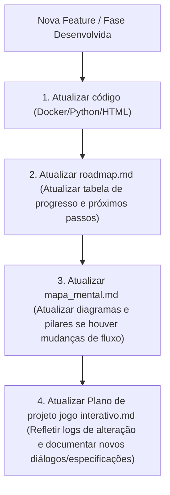

# 🗺️ Roadmap de Evolução: ROOT ACCESS - DevOps Chronicles

Este documento descreve o estado atual do desenvolvimento do jogo e define a **Regra de Sincronização** para manter toda a documentação atualizada conforme progredimos.

---

## 1. Estado Atual do Projeto

| Componente / Fase / Módulo | Status | Descrição |
| :--- | :--- | :--- |
| **Orquestrador Python (`orchestrator.py`)** | ✅ Concluído | Controle de containers Docker local, limites de CPU/Memória, validações e Servidor HTTP API integrado. |
| **Ponte Godot (`OrchestratorBridge.gd`)** | ✅ Concluído | Script GDScript pronto para conectar a Godot Engine ao Orquestrador Python. |
| **Interface Web (`index.html`)** | ⚡ Em Ajuste | Protótipo de jogo em HTML5, responsivo, atualizando a introdução para a nova narrativa e adaptando os desafios. |
| **Módulo 1: O Despertar do Shell (Níveis 1-10)** | 🌟 Super-Expandido | Foco em comandos básicos de navegação e arquivos. Nível 1 integrado ao MVP/HTML5. |
| **Módulo 2: Manipulação e Organização (Níveis 11-20)** | ⏳ Planejado | Estruturação de desafios de cópia, deleção segura e compactação de logs. |
| **Módulo 3: Permissões e Segurança POSIX (Níveis 21-30)** | ⏳ Planejado | Controle de acessos, usuários, chmod avançado e gerenciamento de sudo. |
| **Módulo 4: Redirecionamento e Filtros (Níveis 31-40)** | ⏳ Planejado | Encadeamento com pipes, redirecionamentos de saída/erro e filtragem com grep. |
| **Módulo 5: Processos e Recursos (Níveis 41-50)** | ⏳ Planejado | Monitoramento de RAM, CPU, disco e sinalização de encerramento de processos. |
| **Módulo 6: Fundamentos de Redes e SSH (Níveis 51-60)** | ⏳ Planejado | Resolução de DNS, conectividade, SSH corporativo e segurança com ufw. |
| **Módulo 7: Shell Scripting Avançado (Níveis 61-70)** | ⏳ Planejado | Automação completa de monitoramento do sistema e loops cron. |
| **Módulo 8: Versionamento e CI-CD (Níveis 71-80)** | ⏳ Planejado | Fluxo git, hooks de deploy automático pós-commit em produção. |
| **Módulo 9: Conteinerização Local (Níveis 81-90)** | ⏳ Planejado | Ciclo de vida docker, Dockerfiles customizados e docker-compose multi-serviços. |
| **Módulo 10: Engenharia de Confiabilidade (SRE) (Níveis 91-100)** | ⏳ Planejado | Alta disponibilidade, redundância ativa e lógicas de failover distribuído. |

---

## 2. Protocolo de Sincronização do Projeto (A Regra)

Para evitar que a documentação fique defasada em relação ao código e aos assets físicos do jogo, estabelecemos a seguinte **Regra de Atualização Obrigatória** a cada ciclo de desenvolvimento:

### O que atualizar em cada arquivo:
1.  **`roadmap.md`**: Atualizar a tabela de estados (Pendente ➔ Em Desenvolvimento ➔ Concluído) e anexar melhorias realizadas.
2.  **`mapa_mental.md`**: Atualizar os diagramas Mermaid (fluxo de rede ou campanha) se novas tecnologias forem introduzidas.
3.  **`Plano de projeto jogo interativo.md`**: Registrar a evolução técnica, novos comandos de validação e a expansão dos roteiros de diálogos com a IA.
